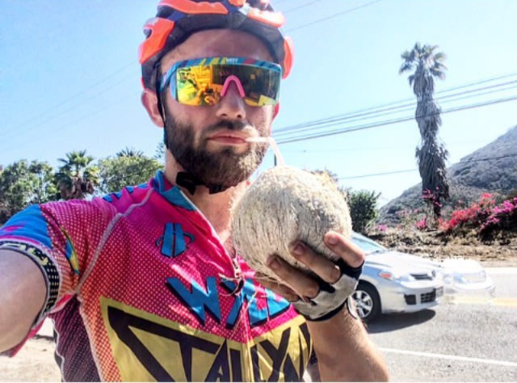
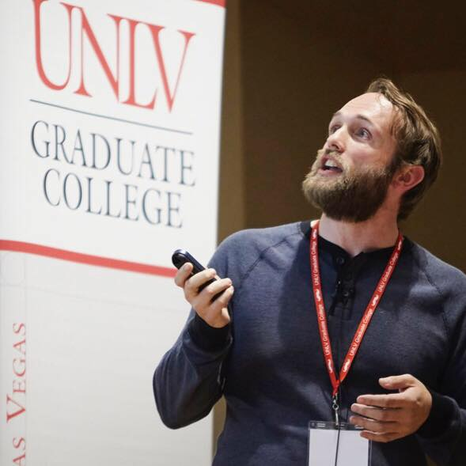

### About Me
I'm a postdoctoral researcher at the US Air Force Institute of Technology. (My less-lengthy, more-official page can be found [here](https://www.afit.edu/BIOS/bio.cfm?facID=398)). I'm a fairly-recent graduate from the University of Nevada, Las Vegas. There, I completed a Ph.D. in applied mathematics under Dr. Monika Neda. 

Apart from my mathematics research and teaching career, my main personal interests revolve around cycling *--pun, regrattably, unintended.* Be it racing, touring, or commuting, it's a hobby that can handly turn into a full time job.

### Research Interests
My research intersts, broadly-stated, include topics in numerical analysis, scientific computing, and computational fluid dynamics. To be more specific, I'm interested in techniques used to approximate turbulent flow regimes, and how sensitive these models are to perturbations of their tuning parameters. The class of models I have the most experience with are large eddy simulation models (LES), which are widely applied in engineering and atmosperic sciences.

### Published Research
S. Breckling, M. Neda, and T. Hill,[A Review of Time Relaxation Methods](http://www.mdpi.com/2311-5521/2/3/40/pdf), *FLUIDS*. 2017; 2,40. (Accepted 2017, Published 2017)

S. Breckling, and M. Neda [Numerical study of the Navier–Stokes-α deconvolution model with pointwise mass conservation](http://www.tandfonline.com/doi/full/10.1080/00207160.2017.1329532), *International Journal of Computer Mathematics*, pp 1-34 (Accepted 2016, Published 2017)

### Submitted Research, and Drafts in Preparation
S. Breckling, M. Neda, and F. Pahlevani, A Sensitivity Study of the Navier-Stokes-α Model, *Submitted, 2017*

S. Breckling, An Extrapolated BDF2 Scheme for Incompressible Flows Regularized by Time Relaxation, *In-Preparation, 2017*

### Conference Proceedings
S. Breckling, P. Kachroo, P. Lakhanpal, M. Neda, Numerical study of traffic flow models, *V International Conference of Industrial Engineering and Environmental Protections Proceedings*, pp.217-222, 2015

### Recent Conference Talks

### Education
**Ph.D. in Applied Mathematics**

University of Nevada, Las Vegas (2017)  
Adviser: Prof. [Monika Neda](https://faculty.unlv.edu/neda/)  
Thesis: Numerical and Sensitivity Analyses of Navier-Stokes-α Models  

**B.S. in Mathematics** 
University of Wisconsin-Milwaukee (2010)

